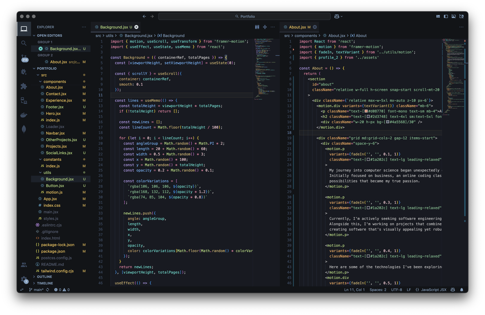

  

<h1 align="center">
  ❄️ Arctic Depth Theme for VS Code
</h1>

  A sleek, high-contrast dark blue theme designed for developers using <a href="https://marketplace.visualstudio.com/items?itemName=MarvellinusVincent.arctic-depth">VS Code</a> who love rich blues and a futuristic aesthetic. It combines deep oceanic tones with crisp Arctic highlights to create a visually striking yet comfortable coding environment.

  
  
  

---

## ✨ Features

- 🎨 **Deep Blue Palette**: Carefully selected blues that reduce eye strain  
- 🔍 **High Contrast**: Clear distinction between syntax elements  
- 🧊 **Modern Aesthetic**: Clean, futuristic design with attention to detail  
- 💻 **Comprehensive Language Support**: Optimized for JavaScript, TypeScript, Python, HTML, CSS, and more  
- 🖥️ **Terminal Colors**: Custom ANSI color scheme that matches the theme  

---

## 📦 Installation

### From VS Code Marketplace

1. Open the **Extensions** view in VSCode (`Ctrl+Shift+X` or `Cmd+Shift+X`)  
2. Search for `"Arctic Depth"`  
3. Click **Install**  
4. Open the **Command Palette** (`Ctrl+Shift+P` or `Cmd+Shift+P`)  
5. Choose **Preferences: Color Theme**  
6. Select **Arctic Depth**  

---

## 🖌️ Color Palette

### 🖥️ UI Colors
| Color Swatch  | Name           | Hex       | Element                          |
|---------------|----------------|-----------|----------------------------------|
|  | Deep Ocean     | `#171A22` | Main editor background           |
|  | Midnight       | `#121417` | Sidebars, panels, status bar     |
|  | Arctic Blue    | `#5E81AC` | Active elements, accents         |
|  | Abyss          | `#1A1C21` | Active tab background            |
|  | Sky Link       | `#5CB2FF` | Clickable links                  |
|  | Error Red      | `#F78070` | Error highlights                 |
|  | Warning Gold   | `#F9C74F` | Warnings                         |
|  | Arctic Gray    | `#81A1C1` | Inactive text                    |

### ✍️ Syntax Colors
| Color Swatch  | Name           | Hex       | Language Construct               |
|---------------|----------------|-----------|----------------------------------|
|  | Lavender       | `#C3A6FF` | Keywords, storage types          |
|  | Soft Pink      | `#F8C8D2` | Numbers, constants               |
|  | Frost Blue     | `#6D9ED4` | Variables                        |
|  | Mint Green     | `#78C490` | Strings                          |
|  | Goldenrod      | `#D4B56A` | Functions, classes               |
|  | Lime           | `#BAE67E` | Tags                             |
|  | Coral          | `#F681A6` | Operators, punctuation           |
|  | Apricot        | `#FFAE57` | Attributes                       |

---

## 🙌 Support

If you enjoy using **Arctic Depth**, consider supporting the project:

- ⭐ **Star** the repository to show your appreciation  
- 🐛 **Report bugs** or issues by opening a GitHub Issue  
- 💖 **Share** the theme with your developer friends  
- 📬 **Suggest features** or improvements — feedback is much appearciated!  

---

## 🧩 Supported Languages

- JavaScript / TypeScript  
- Python  
- HTML / CSS  
- JSON  
- Markdown  
- Java  
- C / C++  
- PHP  
- Go  
- Rust  
- And more...

---

## 📄 License

This project is licensed under the terms of the [MIT License](./LICENSE.md).

